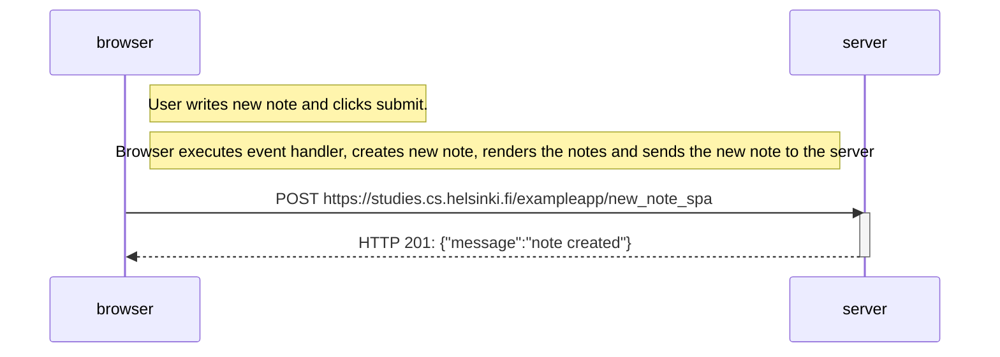

```mermaid
sequenceDiagram
    participant browser
    participant server

    Note right of browser: User writes new note and clicks submit.
    Note right of browser: Browser executes event handler, creates new note, renders the notes and sends the new note to the server

    browser->>server: POST https://studies.cs.helsinki.fi/exampleapp/new_note_spa
    activate server
    server-->>browser: HTTP 201: {"message":"note created"}
    deactivate server
```
